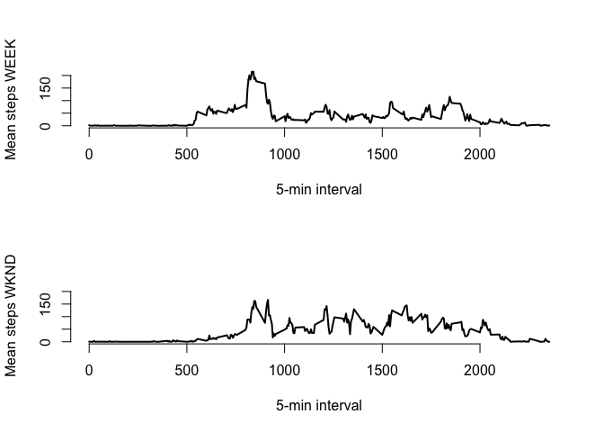

# Reproducible Research: Peer Assessment 1


## Loading and preprocessing the data

```r
activity <- read.csv(file = "activity.csv", header = T, stringsAsFactors = F)
activity$date <-  as.Date(activity$date, format = "%Y-%m-%d")
```
## What is mean total number of steps taken per day?

```r
activity_no_na <- na.omit(activity)
total_steps_day <- aggregate(activity_no_na$steps, by=list(activity_no_na$date), FUN=sum)
hist(total_steps_day$x, xlab="Steps", ylab="Days", main = NA, col = "#7AC5CD", border = "white")
abline(v=mean(total_steps_day$x), lwd=3)
```

<!-- -->

The mean total number of steps is 1.0766\times 10^{4}, showed in the histogram with a black vertical line, the median total number of steps is 1.0765\times 10^{4}

## What is the average daily activity pattern?

```r
ts_steps <- aggregate(activity_no_na$steps, by=list(activity_no_na$interval), FUN=mean)
#ts_steps_sd <- aggregate(activity_no_na$steps, by=list(activity_no_na$interval), FUN=sd, na.rm=F)
plot(ts_steps$Group.1, ts_steps$x, type = "l", 
     frame=F, lwd=2, xlab = "5-min interval", ylab = "Mean steps", xlim=c(0,2500))
max_step <- ts_steps[which(ts_steps$x == max(ts_steps$x)), ]
points(max_step, col="#EE3B3B", pch=8 )
```

<!-- -->

## Imputing missing values
The 5-min intervals with steps values equal to NA will be replaced with the average number of steps for the same time interval.


```r
activity$imputed_steps <- activity$steps
for(i in seq_along(activity$interval)){
        if(is.na(activity$imputed_steps[i])){
                activity$imputed_steps[i] <- ts_steps[match(activity$interval[i], ts_steps$Group.1),2]
        }
}
total_steps_day_imp <- aggregate(activity$imputed_steps, by=list(activity$date), FUN=sum)
hist(total_steps_day_imp$x, xlab="Steps (imputed)", ylab="Number of days", main = NA, col = "#7AC5CD",  border = "white")
abline(v=mean(total_steps_day_imp$x), lwd=3)
```

<!-- -->


## Are there differences in activity patterns between weekdays and weekends?


```r
activity$weekday <- weekdays(activity$date)
activity_WKND <- subset(activity, grepl("S(at|un)", activity$weekday))
activity_WEEK <- subset(activity, !grepl("S(at|un)", activity$weekday))
par(mfrow=c(1,2))
mean_steps_WEEK <- aggregate(activity_WEEK$steps, by=list(activity_WEEK$date), FUN=mean)
hist(mean_steps_WEEK$x, xlab="Mean steps weekdays", ylab="NUmber of days", main = NA, col = "#7AC5CD", 
     border = "white", ylim=c(0,14))
mean_steps_WKND <- aggregate(activity_WKND$steps, by=list(activity_WKND$date), FUN=mean)
hist(mean_steps_WKND$x, xlab="Mean steps weekends", ylab = "Number of days", main = NA, col = "#CD3333", 
     border = "white", breaks = seq(0,80, 10), ylim=c(0,14))
```

<!-- -->

